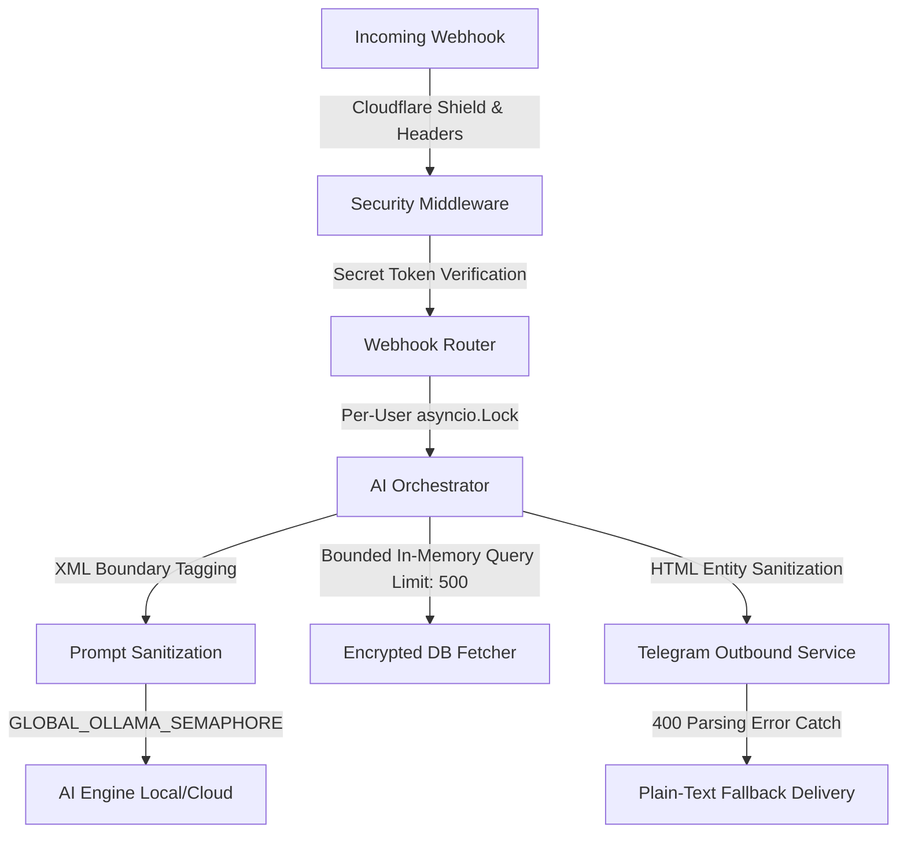
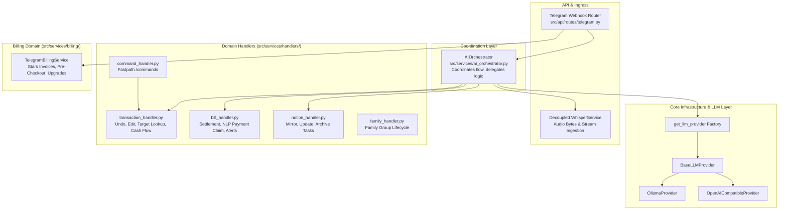

# Architecture Decision Document

_This document builds collaboratively through step-by-step discovery. Sections are appended as we work through each architectural decision together._

## Project Context Analysis

### Requirements Overview

**Functional Requirements:**
- **Asynchronous Messaging Gateway (n8n):** The system must handle real-time webhooks from Telegram and WhatsApp, manage Meta's media download APIs, and route text/audio payloads to the FastAPI core.
- **Dual-AI Pipeline:** Integration of Faster-Whisper for Speech-to-Text and Ollama for structured JSON extraction (Amount, Category, Concept) within the secure FastAPI app.
- **Conversational Query Logic:** A natural language query engine to handle the "ASK" functionality.
- **Multi-tenant Ledger:** A database schema designed around "Family" units for data isolation.
- **Silent Mirroring:** A native Python task to synchronize local records with Notion databases for premium users.

**Non-Functional Requirements:**
- **Performance (The Hard Constraint):** The 3-second rule requires extreme optimization of the AI pipeline.
- **Data Sovereignty:** Absolute requirement for local inference. Data processing cannot be outsourced to external APIs.
- **Encryption at Rest:** Sensitive financial fields must be encrypted using AES-256 before hitting the database.

**Scale & Complexity:**
- Project complexity appears to be: **High**
- Primary technical domain: **Messaging SaaS / AI Engineering / Fintech**
- Estimated architectural components: **6** (Messaging Gateway, AI Orchestrator, PostgreSQL, Notion Sync Worker, Encryption Service, Query Processor)

### Technical Constraints & Dependencies
- **Hardware Bottleneck:** Initial deployment restricted to a single local machine for up to 10 users.
- **Containerization:** Use Podman for local container management for future portability.

### Cross-Cutting Concerns Identified
- **Pipeline Performance Monitoring:** Instrumented tracing for every stage (STT -> LLM -> DB).
- **Tenant Scoping:** Universal middleware for `family_id` filtering.
- **Encryption Utility:** Standardized service for transparent field-level encryption/decryption.

## Starter Template Evaluation

### Primary Technology Domain

**High-Performance AI Backend (FastAPI)** based on the requirement for real-time local AI processing and asynchronous messaging.

### Starter Options Considered

1.  **FastAPI Full Stack (Tiangolo):** Evaluated for its robustness but rejected due to excessive frontend overhead (React/Vue) not required for the messaging-first MVP.
2.  **NestJS (TypeScript):** Evaluated for its enterprise structure but rejected in favor of Python for better native integration with Ollama and Faster-Whisper.
3.  **Native FastAPI Asynchronous Messaging Gateway (Selected):** A monolithic architecture using FastAPI for everything: channel connections (native Telegram webhook ingress), Notion integration via Python API, secure local AI processing, multi-tenant databases, and field-level encryption.

### Selected Starter: Native FastAPI Blueprint

**Rationale for Selection:**
This approach provides the lowest latency and resource footprint by eliminating intermediate gateways (like n8n). Direct Telegram webhook processing inside our secure, compiled FastAPI Python backend ensures `< 80MB` memory footprint, making it eligible for free-tier deployments.

**Initialization Command:**

```bash
pip install fastapi[all] sqlmodel cryptography ollama faster-whisper python-telegram-bot
```

**Architectural Decisions Provided by Starter:**

**Language & Runtime:**
Python 3.10+ using FastAPI for non-blocking asynchronous I/O.

**Styling Solution:**
N/A (Messaging interface primarily).

**Build Tooling:**
Podman + Podman Compose for container orchestration and environment isolation.

**Testing Framework:**
Pytest for unit and integration testing of the AI extraction pipeline.

**Code Organization:**
"Service Layer" pattern separating API logic, AI inference (services), and Database access.

**Development Experience:**
FastAPI auto-generated Swagger UI and Uvicorn hot-reloading.

**Note:** Project initialization using this command should be the first implementation story.

## Core Architectural Decisions

### Decision Priority Analysis

**Critical Decisions (Block Implementation):**
- **Data Privacy:** Application-Level AES-256 Encryption (FastAPI handles encryption inside Python before writing to Postgres).
- **Inference Engine:** Ollama (LLM) and Faster-Whisper (STT) for local execution via Python service wrappers.
- **Messaging Router:** Native FastAPI webhook endpoint (`/api/v1/telegram/webhook`) utilizing `httpx` to handle Telegram Webhook ingestion and outbound replies.
- **Async Strategy:** FastAPI `BackgroundTasks` for non-blocking 3s confirmation loops.

**Important Decisions (Shape Architecture):**
- **Multi-Tenancy:** Shared schema with `family_id` scoping and row-level filtering.
- **ORM:** SQLModel for unified Pydantic/SQLAlchemy modeling.
- **Authentication:** Telegram and WhatsApp User IDs mapped to `User` and `Family` tables, routed and verified via Telegram's native `X-Telegram-Bot-Api-Secret-Token`.

**Deferred Decisions (Post-MVP):**
- **Distributed Workers:** Migration to Celery/Redis deferred until Phase 2 scaling (>10 users).
- **Web Dashboard:** Full React/Next.js frontend deferred to Phase 3.

### Data Architecture

- **Database:** PostgreSQL (v16+) via SQLModel.
- **Encryption:** `cryptography` (Python library) using Fernet (AES-256) for field-level masking.
- **Multi-Tenancy:** Single database, single schema, with a mandatory `family_id` on all financial tables.

### Authentication & Security

- **Identity:** Telegram `user_id` and `chat_id`.
- **Integrity:** HMAC-SHA256 signature verification for all incoming Telegram webhooks.
- **Key Management:** Encryption keys stored as environment variables (loaded into `BaseSettings`).

### API & Communication Patterns

- **API Style:** REST (FastAPI) exposing a secure, public `/api/v1/telegram/webhook` router to receive standardized updates directly from Telegram.
- **Payload Schema:** Native Telegram `Update` JSON object.
- **Asynchrony:** FastAPI immediately acknowledges incoming webhooks with HTTP 200. It uses `BackgroundTasks` to orchestrate transcription and extraction and instructs the outbound service to send the final confirmation message via Telegram API.

### Decision Impact Analysis

**Implementation Sequence:**
1.  Initialize Repository with Podman/FastAPI.
2.  Implement Encryption Utility Service.
3.  Set up SQLModel schemas with `family_id`.
4.  Build the Telegram Webhook handler with signature verification.
5.  Integrate the Faster-Whisper and Ollama orchestrator.

**Cross-Component Dependencies:**
The Encryption Utility is a "Hard Dependency" for the Database layer; no transaction can be written without the encryption service being active.

## Implementation Patterns & Consistency Rules

### Naming Patterns

**Database Naming Conventions:**
- Tables and Columns: `snake_case` (e.g., `user_profiles`, `family_id`).
- Primary Keys: `id` (UUIDv4 suggested).

**API Naming Conventions:**
- Endpoints: `snake_case` (e.g., `/api/v1/get_spending_summary`).
- JSON Keys: `snake_case` (e.g., `{ "transaction_amount": 10.5 }`).

**Code Naming Conventions:**
- Functions/Variables: `snake_case` (PEP8).
- Classes: `PascalCase`.
- Files: `snake_case.py`.

### Structure Patterns

**Project Organization:**
- **Service Layer:** All heavy logic (Ollama, Whisper, Encryption) MUST reside in `services/` classes. API routes are restricted to request validation and service orchestration.
- **Models:** All SQLModel definitions reside in `models/` for centralized schema management.

### Format Patterns

**API Response Formats:**
- **Success:** `{ "status": "success", "data": { ... } }`
- **Error:** `{ "status": "error", "message": "Friendly error", "code": "ERROR_CODE" }`

**Data Exchange Formats:**
- Dates: ISO-8601 strings.
- Booleans: Native JSON `true`/`false`.

### Process Patterns

**Error Handling Patterns:**
- Use custom exception classes (e.g., `InferenceError`) to distinguish between AI failures and system errors.
- Global FastAPI exception handlers to wrap all errors into the standard response format.

**Instrumentation Patterns:**
- **The 3s Audit:** Every AI service call must measure and log its execution time (start/end) to ensure PRD compliance.

### Enforcement Guidelines

**All AI Agents MUST:**
- Use the `EncryptionService` for any field marked as sensitive in the schema.
- Follow the `services/` pattern—never implement business logic inside `main.py`.
- Ensure every database query is filtered by a `family_id` context.

## Project Structure & Boundaries

### Complete Project Directory Structure

```text
clanomy/
├── docker-compose.yaml      # Multi-container orchestration (FastAPI + Postgres)
├── .env.example             # Template for Bot Tokens, Encryption Keys
├── requirements.txt         # Core dependencies (FastAPI, SQLModel, Ollama, etc.)
├── src/
│   ├── main.py              # FastAPI application entry & global exception handlers
│   ├── api/                 # Endpoint logic & request routing
│   │   ├── routes/
│   │   │   ├── telegram.py  # Native endpoint to process updates from Telegram
│   │   │   ├── queries.py   # The "ASK" query handlers
│   │   │   └── family.py    # Family management (Phase 2)
│   │   └── deps.py          # FastAPI Dependables (Current Family Context, DB Session)
│   ├── core/                # Cross-cutting system logic
│   │   ├── config.py        # Pydantic Settings (Environment validation)
│   │   ├── security.py      # Internal webhook security verification
│   │   └── encryption.py    # AES-256 Application-level encryption service
│   ├── services/            # Implementation of the "Inference Pipeline"
│   │   ├── ai_orchestrator.py # Manages the 3s STT -> LLM flow
│   │   ├── whisper_service.py # Faster-Whisper wrapper
│   │   ├── extraction_service.py # Ollama LLM wrapper (JSON Mode)
│   │   └── notion_mirror.py   # Notion mirroring logic (Phase 2)
│   └── db/
│       ├── session.py       # SQLAlchemy engine & session factory
│       └── models.py        # Unified SQLModel schemas (User, Transaction, Family)
├── tests/                   # Performance and Accuracy auditing
│   ├── api/                 # Endpoint integration tests
│   ├── services/            # AI Extraction accuracy benchmarks (The 90% test)
│   └── conftest.py          # Shared test fixtures
└── scripts/
    └── backup_db.py         # Automated local backup routine
```

### Architectural Boundaries

**API Boundaries:**
- The system exposes a single public webhook endpoint for Telegram interaction. 
- Internal boundaries exist between the API routes and the Service layer, ensuring that no raw I/O (like audio processing) blocks the main event loop.

**Component Boundaries:**
- **Inference vs. API:** The AI orchestrator runs in a non-blocking context, allowing the API to return a confirmation to Telegram immediately while processing continues if needed.

**Service Boundaries:**
- **Encryption Service:** Actively isolates the Database from raw PII.
- **AI Services:** Isolate the complexity of Ollama and Faster-Whisper from the business logic.

**Data Boundaries:**
- **Tenant Isolation:** Enforced via a `family_id` on every transaction record.

### Requirements to Structure Mapping

**Feature/Epic Mapping:**
- **Zero-Friction Entry:** `api/routes/logging.py`, `services/whisper_service.py`, `services/extraction_service.py`.
- **"ASK" Queries:** `api/routes/queries.py`, `services/query_service.py`.
- **Privacy Core:** `core/encryption.py`, `db/models.py`.

**Cross-Cutting Concerns:**
- **The 3s Rule Audit:** Instrumented within `services/ai_orchestrator.py`.
- Multi-Tenancy: Handled in `api/deps.py` and `db/models.py`.

## Architecture Validation Results

### Coherence Validation ✅

**Decision Compatibility:**
Python 3.10+ serves as the unified runtime for FastAPI, SQLModel, Faster-Whisper, and the Ollama client. Non-blocking I/O is maintained throughout the pipeline.

**Pattern Consistency:**
Strict snake_case is enforced across Code, API, and DB to minimize "translation" logic and reduce mapping bugs.

**Structure Alignment:**
The service-layer pattern (isolating AI and Encryption) ensures that the core application remains testable and scalable.

### Requirements Coverage Validation ✅

**Functional Requirements Coverage:**
- **Zero-Friction Entry:** Covered by the asynchronous Whisper/Ollama pipeline.
- **"ASK" Queries:** Supported by a dedicated query service and LLM processing.

**Non-Functional Requirements Coverage:**
- **The 3-Second Rule:** Architecturally prioritized via local inference and async orchestration.
- **Privacy:** Guaranteed by application-level AES-256 encryption and local processing.

### Implementation Readiness Validation ✅

**Decision Completeness:**
All critical technology choices (Framework, AI Engines, DB) are locked with versions and rationale.

**Structure Completeness:**
A comprehensive project directory structure has been defined, mapping features to specific files.

**Pattern Completeness:**
Clear naming conventions and process patterns (like the 3s Audit) are established.

### Gap Analysis Results

- **Prompt Specification (Important):** The exact system prompt for Ollama JSON extraction will be defined during the implementation of the `extraction_service.py`.
- **Key Rotation (Minor):** Master key rotation policy is deferred to Phase 2.

### Architecture Completeness Checklist

**Requirements Analysis**
- [x] Project context thoroughly analyzed
- [x] Scale and complexity assessed
- [x] Technical constraints identified
- [x] Cross-cutting concerns mapped

**Architectural Decisions**
- [x] Critical decisions documented with versions
- [x] Technology stack fully specified
- [x] Integration patterns defined
- [x] Performance considerations addressed

**Implementation Patterns**
- [x] Naming conventions established
- [x] Structure patterns defined
- [x] Communication patterns specified
- [x] Process patterns documented

**Project Structure**
- [x] Complete directory structure defined
- [x] Component boundaries established
- [x] Integration points mapped
- [x] Requirements to structure mapping complete

### Architecture Readiness Assessment

**Overall Status:** READY FOR IMPLEMENTATION
**Confidence Level:** High

**Key Strengths:**
- Extreme focus on latency (The 3s Rule).
- Hardened privacy via local AI and field-level encryption.
- Clean separation of concerns through a service-oriented architecture.

### Implementation Handoff

**AI Agent Guidelines:**
- Follow all architectural decisions exactly as documented.
- Use the standard `snake_case` patterns for all new files and fields.
- Refer to the `Implementation Sequence` for story priority.

**First Implementation Priority:**
Initialize Repository with Podman and FastAPI using the following dependencies:
`pip install fastapi[all] sqlmodel cryptography ollama faster-whisper python-telegram-bot`

## Epic 4 Technical Research & Design

This section details the pre-implementation research conducted in preparation for **Epic 4: Data Portability & Rights**.

### 1. Telegram Document Transmission API
To support transaction history export (Story 4.1), the system must transmit generated CSV/JSON files to the Telegram Bot API. 
The standard Telegram API endpoint is `https://api.telegram.org/bot<TOKEN>/sendDocument`.

**API Specifications:**
- **HTTP Method:** `POST`
- **Content-Type:** `multipart/form-data`
- **Required Parameters:**
  - `chat_id`: Integer or string (target chat identifier).
  - `document`: InputFile (the local file stream to upload).
- **Optional Parameters:**
  - `caption`: String (conversational message summary attached to the document, up to 1024 characters).
  - `parse_mode`: String (`HTML` or `MarkdownV2`).

**Proposed Implementation in `TelegramService`:**
```python
import os
import httpx

async def send_document(self, chat_id: int, file_path: str, caption: Optional[str] = None) -> None:
    """Sends a local file to the user via Telegram Bot API's sendDocument."""
    filename = os.path.basename(file_path)
    try:
        async with httpx.AsyncClient() as client:
            with open(file_path, "rb") as file:
                files = {"document": (filename, file, "application/octet-stream")}
                data = {"chat_id": chat_id}
                if caption:
                    data["caption"] = caption
                    data["parse_mode"] = "HTML"
                
                response = await client.post(
                    f"{self.api_url}/sendDocument",
                    data=data,
                    files=files
                )
                response.raise_for_status()
    except Exception as e:
        logger.error(f"Failed to send telegram document to {chat_id}: {e}")
        raise
```

### 2. Secure Temporary File & Cleanup Pipeline
Because data exports contain raw, decrypted financial entries (PII), we must enforce a zero-leak storage pipeline. Files must never persist on the host server after transmission.

**Design Strategy:**
- Use standard `tempfile` to create unique, system-isolated file paths.
- Enforce strict `try-finally` blocks or python context managers to guarantee physical deletion from host disk.
- Avoid writing files in project-level paths; use the OS-specific system temporary directory.

**Proposed Generation Pattern:**
```python
import os
import tempfile

# 1. Establish secure temp file path
fd, path = tempfile.mkstemp(suffix=".csv", prefix=f"clanomy_export_{user_id}_")
try:
    # 2. Open file descriptor and write decrypted CSV data
    with os.fdopen(fd, 'w', newline='', encoding='utf-8') as f:
        writer = csv.writer(f)
        writer.writerow(["Date", "Amount", "Currency", "Concept", "Category"])
        for tx in decrypted_transactions:
            writer.writerow([tx.timestamp, tx.amount, tx.currency, tx.concept, tx.category])
            
    # 3. Deliver file through Telegram API
    await telegram_service.send_document(chat_id, path, caption="Here is your requested export! 📊")
finally:
    # 4. Enforce cleanup (physical deletion)
    if os.path.exists(path):
        try:
            os.unlink(path)
            logger.info(f"Purged temp export file from disk: {path}")
        except Exception as e:
            logger.error(f"Failed to delete temp file {path}: {e}")
```

### 3. Multi-Tenant Cascade Deletes Validation
For GDPR "Right to be Forgotten" (Story 4.2), account deletion must cascade delete all associated records (User and Transaction units) atomically.

**ORM Mapping & Constraints:**
- SQLModel/SQLAlchemy relations on `Family` and `User` models are configured with `sa_relationship_kwargs={"cascade": "all, delete-orphan"}`.
- Foreign keys in `User` and `Transaction` models are marked with `ondelete="CASCADE"`.
- This ensures that:
  - Deleting a `Family` triggers SQLAlchemy to delete all dependent `User` and `Transaction` records in Python.
  - Deleting a `User` triggers SQLAlchemy to delete all dependent `Transaction` records in Python.
  - SQLite/PostgreSQL foreign keys act as secondary layers for database-level cascades on direct SQL executions.

**Verification Status:**
- Cascade delete operations have been verified with automated unit tests in `tests/db/test_models.py` (`test_cascade_delete_family` and `test_cascade_delete_user`), yielding a 100% pass rate in memory.

## Epic 8 Technical Research & Architectural Design (Income & Net Cash Flow)

This section details the architectural decisions and design specifications for **Epic 8: Family Income & Net Cash Flow Tracking**, implementing **Option A (Unified Transaction Model with Type Discriminator)**.

### 1. Schema Extension (`Transaction.type`)

Rather than maintaining separate, duplicated schemas for income and expenses, the `Transaction` table is augmented with a single indexed discriminator field:

```python
class Transaction(SQLModel, table=True):
    id: UUID = Field(default_factory=uuid4, primary_key=True)
    family_id: UUID = Field(foreign_key="family.id", index=True, ondelete="CASCADE")
    user_id: UUID = Field(foreign_key="user.id", index=True, ondelete="CASCADE")
    
    # Financial data (ciphertext)
    amount: str
    concept: str
    
    # Discriminator and categorization
    type: str = Field(default="expense", index=True) # "expense" | "income"
    category: str = Field(index=True)
    timestamp: datetime = Field(default_factory=lambda: datetime.now(timezone.utc), index=True)

    notion_page_id: Optional[str] = Field(default=None, nullable=True, index=True)
    notion_synced_at: Optional[datetime] = Field(default=None, nullable=True)

    # Relationships
    family: Family = Relationship(back_populates="transactions")
    user: User = Relationship(back_populates="transactions")
```

**Architectural Invariants & Trade-offs:**
- **Zero Schema Fragmentation:** Preserves uniform multi-tenant scoping (`family_id`), AES-256 field encryption (`amount`, `concept`), and relational cascades.
- **Backward Compatibility:** Default value `"expense"` ensures existing records and queries continue to function identically without complex data migrations.
- **Database Indexing:** Composite or single-column indexes on `(family_id, type, timestamp)` optimize time-windowed cash-flow aggregations.

### 2. Dual-Intent LLM Extraction Pipeline

The Ollama extraction prompt is upgraded to classify transaction intent in addition to entity extraction:

**Extraction Output Schema:**
```json
{
  "type": "expense | income",
  "amount": 4200.0,
  "currency": "USD",
  "category": "Salary",
  "concept": "Acme Corp Paycheck"
}
```

**Intent Heuristics & Fail-safes:**
- Earnings keywords: *"salary"*, *"earned"*, *"got paid"*, *"sold"*, *"bonus"*, *"freelance payment"*, *"dividend"*, *"received"* $\rightarrow$ `type: "income"`.
- Spending keywords: *"spent"*, *"bought"*, *"paid for"*, *"coffee"*, *"uber"*, *"lunch"* $\rightarrow$ `type: "expense"`.
- Ambiguous inputs default safely to `type: "expense"`.

### 3. Net Cash Flow & Aggregation Engine

The Query and Analytics service calculates period balances via atomic aggregation:

$$\text{Net Balance} = \sum \text{Income} - \sum \text{Expenses}$$
$$\text{Savings Rate} = \left( \frac{\text{Net Balance}}{\sum \text{Income}} \right) \times 100 \quad (\text{if } \sum \text{Income} > 0)$$

**Conversational Feedback Logic:**
- **Income Logging Confirmation:** Upbeat tone with monthly cumulative earnings and updated net balance.
- **"ASK" Summary Queries:** Delivers both total spend, total earnings, and net balance when requested (e.g. *"What is our net balance this month?"* or *"How much did we make in August?"*).

### 4. Integration Impact (Notion Mirror & GDPR Exports)

- **Notion Mirroring:** Pushes a `Type` select property (`Expense` vs `Income`) and assigns positive values in the Notion database.
- **GDPR Export (CSV/JSON):** Updates export headers to include `Type`:
  `["Date", "Type", "Amount", "Currency", "Concept", "Category"]`

---

## Production Architectural Evolution (Epics 9 through 13)

The following architectural specifications document the production hardening, domain-driven decomposition, security audit remediation, and multi-currency/scheduled commitments infrastructure.

### 1. Modular Architecture & Domain Decomposition (Epic 12)

To eliminate code bloating and circular dependencies, the monolithic services (`extraction_service.py`, `query_service.py`, and `ai_orchestrator.py`) were decomposed into clean, focused sub-packages:

```text
src/services/
├── extraction/
│   ├── __init__.py          # Public facade re-exporting ExtractionService, schemas
│   ├── models.py            # ExtractionResult, UnifiedResult, ExtractionError
│   ├── normalizers.py       # Category dictionaries, ISO currency normalization
│   ├── prompts.py           # Security-hardened prompt templates & XML fences
│   ├── fallback.py          # Deterministic regex extraction & classification engine
│   └── service.py           # ExtractionService implementation, Ollama & Cloud AI callers
├── query/
│   ├── __init__.py          # Public facade re-exporting QueryService, models
│   ├── models.py            # ParsedQueryIntent, QueryResult, TimeAggregation, NetCashFlow
│   ├── date_resolver.py     # Relative & calendar date resolution (bilingual ES/EN)
│   ├── aggregator.py        # Mathematical aggregation algorithms (time, category, member)
│   ├── formatters.py        # Fallback summary formatters & prompt context builders
│   └── service.py           # QueryService implementation & encrypted DB fetcher
├── handlers/
│   ├── __init__.py          # Facade re-exporting all specialized command handlers
│   ├── account_handler.py   # Account deletion & GDPR workflows
│   ├── currency_handler.py  # Household currency configuration (/currency)
│   ├── family_handler.py    # Household invites, removals, and /family listings
│   └── notion_handler.py    # Notion connection, sync status, and manual trigger
├── ai_orchestrator.py       # Lean orchestrator routing intents & managing concurrency
├── messaging_service.py     # Atomic user/family provisioning
├── notification_scheduler.py# Automated trial lifecycle scheduler
├── notion_service.py        # Notion client with exponential retry
├── subscription_service.py  # Telegram Stars & quota management
├── telegram_service.py      # Resilient Telegram API client with HTML fallback
└── whisper_service.py       # Faster-Whisper local STT & Cloud Whisper integration
```

**Backwards-Compatibility Guarantee:**
`src/services/extraction_service.py` and `src/services/query_service.py` act as zero-downtime re-export shims, allowing existing imports (`from src.services.extraction_service import ExtractionService`) to function without modifications.

### 2. Database Migration Engine (Alembic)

Clanomy employs Alembic for automated, version-controlled relational database schema migrations:
- **Location:** `alembic/` and `alembic.ini`.
- **Automated Startup Runner:** Integrated in `src/main.py` lifespan context manager. On startup, Alembic applies all pending migrations automatically before accepting traffic:
  ```python
  @asynccontextmanager
  async def lifespan(app: FastAPI):
      run_migrations()  # Executes alembic upgrade head
      yield
  ```
- **Migration Sequence:**
  1. `0001_initial_baseline.py`: Tables `family`, `user`, `transaction`, `familyinvite`.
  2. `0002_subscription_schema_expansion.py`: Adds subscription fields to `family` (`plan_type`, `subscription_status`, `monthly_tx_count`, `trial_ends_at`, etc.).
  3. `0003_add_user_is_admin.py`: Adds `is_admin` column to `user`.
  4. `0004_enable_rls_security.py`: Configures PostgreSQL row-level security (RLS).
  5. `0005_add_family_default_currency.py`: Adds `default_currency` (ISO-4217, default "USD") to `family`.
  6. `0006_add_scheduled_bill.py`: Creates `scheduled_bill` table with encrypted fields and foreign keys.

### 3. Enterprise Security Hardening (SEC-01 through SEC-06 - Epic 11)

Following an exhaustive forensic security and architectural audit, six core security patterns were engineered:



1. **SEC-01: Multi-Tenant Zero-Recycling Isolation (`leave_family`):**
   When a user leaves a family group (`/leavefamily`), Clanomy strictly instantiates a fresh, isolated `Family` record with clean credentials. Old Notion keys, database IDs, and transaction associations are never inherited.
2. **SEC-02: HTML Entity Sanitization & Telegram Delivery Fallback:**
   All user-supplied transaction concepts and categories are escaped via `html.escape()` before being embedded in Telegram HTML cards. Furthermore, `TelegramService.send_message()` catches HTTP 400 parsing errors and automatically retries with `parse_mode=None` (safe plain text).
3. **SEC-03: Prompt Injection Defense via XML Boundary Fencing:**
   User text is stripped of markdown code fences (```` ``` ````) and strictly enclosed inside `<user_input>` XML tags in both Cloud AI and Ollama prompts (`src/core/ai_client.py` and `prompts.py`).
4. **SEC-04: Per-User Concurrency Serialization:**
   `AIOrchestrator` maintains an in-memory dictionary of `asyncio.Lock` instances keyed by `user_id`. Rapid sequential inputs, `/undo` requests, and corrections are serialized, preventing race conditions.
5. **SEC-05: Global AI Concurrency Semaphore:**
   `GLOBAL_OLLAMA_SEMAPHORE` in `src/core/ai_client.py` sets a global threshold (`OLLAMA_MAX_CONCURRENT`) across all inference services, preventing CPU and memory exhaustion on self-hosted servers.
6. **SEC-06: Bounded Query In-Memory Decryption Limit:**
   To prevent denial-of-service via massive result sets, database queries for open-ended summaries are capped at `MAX_QUERY_TRANSACTIONS_LIMIT: 500` records before Fernet in-memory decryption.

### 4. Multi-Currency & Bilingual Localization Architecture (Epic 9)

To serve international users without requiring environment variable reconfiguration:
- **Database Model:** `Family.default_currency` stores the 3-letter ISO-4217 currency code (e.g., `"ARS"`, `"USD"`, `"EUR"`, `"MXN"`).
- **Dynamic Resolution:** When `ExtractionService` parses numeric entries without currency indicators (*"500 en pizza"*), it dynamically injects the family's configured currency into the prompt.
- **Segregated Cash Flow:** `QueryService.aggregate_transactions()` groups amounts by currency code, outputting multi-currency breakdowns instead of conflating amounts.
- **Empty-State Localization:** Summary formatters render zero-transaction states in the family's default currency (e.g. `$0.00 ARS` instead of `$0.00 USD`).

### 5. Scheduled Obligations & Conversational Settlement Architecture (Epic 10)

```python
class ScheduledBill(SQLModel, table=True):
    __tablename__ = "scheduled_bill"

    id: UUID = Field(default_factory=uuid4, primary_key=True)
    family_id: UUID = Field(foreign_key="family.id", index=True, ondelete="CASCADE")
    user_id: UUID = Field(foreign_key="user.id", index=True, ondelete="CASCADE")

    # Sensitive fields encrypted at rest (AES-256)
    amount: str
    concept: str

    category: str = Field(index=True)
    due_date: datetime = Field(index=True)
    status: str = Field(default="pending", index=True, max_length=15) # pending, paid, cancelled

    paid_transaction_id: Optional[UUID] = Field(default=None, foreign_key="transaction.id", nullable=True, ondelete="SET NULL")
    created_at: datetime = Field(default_factory=lambda: datetime.now(timezone.utc))
```

- **Batch Due-Date NLP Extraction:** Recognizes temporal obligations (*"El 10 vence la luz 45000 y el 15 internet 18000"*) and extracts both amount, concept, category, and due date.
- **Zero-Amount Conversational Settlement:** When a user messages *"Pagué la visa"* without an amount:
  1. Primary Lookup: Searches pending bills belonging to the sender (`user_id == current_user.id`).
  2. Family Fallback: Searches pending bills belonging to other family members.
  3. Action: Decrypts bill amount, writes a new `Transaction` under category `"Rent/Bills"`, marks bill `status="paid"`, links `paid_transaction_id`, and dispatches Notion mirroring.
- **Proactive Status Alerts:** Monthly status inquiries (*"¿cómo venimos este mes?"*) evaluate pending obligations where `due_date <= now()` and append overdue reminders to the financial summary.

### 6. Hybrid AI & Deterministic Offline Fallback Architecture (Epics 12 & 13)

- **Cloud / Local Hybrid Routing:**
  - Local mode: Faster-Whisper + Ollama (`llama3:latest`).
  - Cloud mode: Groq Cloud Whisper (`whisper-large-v3`) + Groq Cloud LLM (`llama-3.3-70b-versatile`).
- **Deterministic Regex Fallback Engine (`src/services/extraction/fallback.py`):**
  - High-precision regular expressions extract transaction type, amount, currency, category, and concept.
  - Acts as an automatic circuit breaker: if local or cloud AI fails or times out, the fallback engine processes the message without user-facing errors.

### 7. CI/CD Quality Gates & Automated Testing Pyramid (Epic 13)

- **Test Suite Scale:** 347 automated tests covering API, database models, encryption, services, and security invariants.
- **Automated Workflows:**
  - `.github/workflows/test.yml`: Runs on push and PR to `master`, isolates SQLite/Postgres test environments, and enforces an **85% minimum code coverage threshold**.
  - `.github/workflows/pr-guardrail.yml`: Protects sensitive files (`subscription_service.py`, `subscription_config.py`, `monetization-and-subscription-strategy.md`, `README.md`, `.github/workflows/`) against unauthorized alterations.

### 8. Pre-Built Fast-Path Commands & Hybrid Quota Architecture (Epic 14)

To achieve maximum response speed, zero AI operational cost, and eliminate user quota anxiety, Clanomy implements a **Hybrid Execution Routing Engine**:

```mermaid
flowchart TD
    Webhook[Incoming Telegram Webhook] --> IsCommand{Starts with /command?<br>/month, /me, /today, /bills, /balance}
    
    IsCommand -- YES --> FastPath[CommandHandler<br>Pure Python & SQL]
    FastPath --> DirectAgg[In-Memory Aggregator & Multi-Currency Formatter]
    DirectAgg --> InstantResp[Telegram HTML Response<br>Latency: <40ms | Cost: $0 | Quota: Unlimited]
    
    IsCommand -- NO (Natural Text/Voice) --> QuotaCheck{Free Tier Quota<br>< 20 AI logs/mo?}
    QuotaCheck -- Exceeded --> BlockMsg[Upgrade Notice + Suggest Unlimited /commands]
    QuotaCheck -- OK --> AIOrchestrator[AI Orchestrator Pipeline<br>STT + LLM Inference]
    AIOrchestrator --> IncQuota[Increment Family.monthly_tx_count]
    IncQuota --> AppendTip[Append Contextual Shortcut Pro-Tip]
    AppendTip --> AIResp[Telegram Response<br>Latency: ~1.5s | Cost: LLM tokens]
```

- **Deterministic Command Suite (`src/services/handlers/command_handler.py`):**
  - `/month` (and `/resumen`): Whole family financial status with member-by-member breakdown. Supports `/month last`.
  - `/me` (and `/yo`): Caller's personal income, expenses, net savings, and top 4 expense categories.
  - `/today` (and `/hoy`): Summary of transactions recorded today.
  - `/bills` (and `/vencimientos`): Upcoming pending scheduled obligations.
  - `/balance` (and `/saldo`): Net cash flow and savings rate overview.
  - `/undo` (and `/deshacer`): Reverts caller's latest recorded transaction.
  - `/help` (and `/ayuda`): Complete command directory and AI guide.
- **Member Segregation with Multi-Currency Isolation:**
  - `MemberSpending.income_currency_totals` and `MemberSpending.expense_currency_totals` record distinct currency maps for every family member.
  - Formatter renders single-currency budgets compactly and multi-currency budgets with distinct ISO totals, never mixing un-converted currencies.
- **20-Log Free Tier Quota & Context-Aware Pro-Tips:**
  - `FREE_TIER_MONTHLY_LIMIT = 20` governs natural language AI processing.
  - Deterministic slash commands bypass the quota check and are 100% free and unlimited.
  - Natural language queries append a plan-aware Pro-Tip (*💡 Pro-tip: Type /month or /me...*) guiding users to instant commands.

### 9. Modular Clean Code Architecture & Service Decomposition (Post-Audit Refactoring)

Following a comprehensive architectural and clean-code audit, Clanomy completed a full decomposition of legacy monolithic aggregators (`ai_orchestrator.py` and `routes/telegram.py`):



1. **Unified LLM Provider Abstraction (`src/core/llm/`):**
   - **`BaseLLMProvider`**: Core abstract interface enforcing `generate()` and `extract_structured()`.
   - **`OllamaProvider`**: Native implementation for local, offline inference connecting to Ollama HTTP API (`/api/generate` and `/api/chat`).
   - **`OpenAICompatibleProvider`**: Connects to OpenAI-compliant APIs (e.g. Groq Cloud, OpenAI, Together AI) supporting JSON-mode and structured schema enforcement.
   - **`get_llm_provider()` Factory**: Dynamically instantiates the appropriate provider based on environment variables (`AI_API_KEY`, `OLLAMA_BASE_URL`, `AI_MODEL`), enabling zero-code transitions between self-hosted hardware and cloud infrastructure.

2. **Domain Handlers Decomposition (`src/services/handlers/`):**
   - **`transaction_handler.py`**: Encapsulates targeted undo, field corrections (`amount`, `concept`, `category`, `type`), coupled currency exchange reversals, and multi-currency monthly cash-flow snapshots.
   - **`bill_handler.py`**: Encapsulates scheduled bill settlement when an expense is logged, zero-amount conversational payment claims (*"Pagué la tarjeta"*), and overdue bill reminder blocks.
   - **`notion_handler.py`**: Decouples asynchronous background mirroring, page property updates, and archival tasks from the request lifecycle.
   - **`command_handler.py`**: Dedicated handling of fast-path slash commands with zero quota consumption.
   - **`family_handler.py`**: Manages family creation, member invitation links, and tenant boundaries.

3. **Decoupled Billing & Payment Domain (`src/services/billing/`):**
   - **`TelegramBillingService`**: Isolates Telegram Stars invoice generation (`send_subscription_invoice`), pre-checkout query verification (`answer_pre_checkout_query`), and payment charge webhooks (`handle_successful_payment`).
   - **`telegram_messages.py`**: Dedicated catalog of localized billing templates, tier descriptions, and payment receipts.
   - **PR Guardrail Protection**: `.github/workflows/pr-guardrail.yml` strictly guards `src/services/billing/` to prevent unauthorized billing alterations from pull requests.

4. **Self-Hosted vs. Multi-Tenant SaaS Parity:**
   - **Identical Core Codebase:** Both operating models execute identical business logic across the same domain handlers.
   - **Self-Hosted Mode (`ENABLE_SUBSCRIPTIONS=false`):** Bypasses all quota checks (`can_log_transaction` and `has_unlimited_access` return `True`), suppresses Stars billing invoices, and enables `ALLOWED_TELEGRAM_USERS` pre-inference allowlisting.
   - **Multi-Tenant SaaS Mode (`ENABLE_SUBSCRIPTIONS=true`):** Enforces family monthly quotas, AES-256 field encryption, tenant isolation, and automated trial expiration lifecycles.


